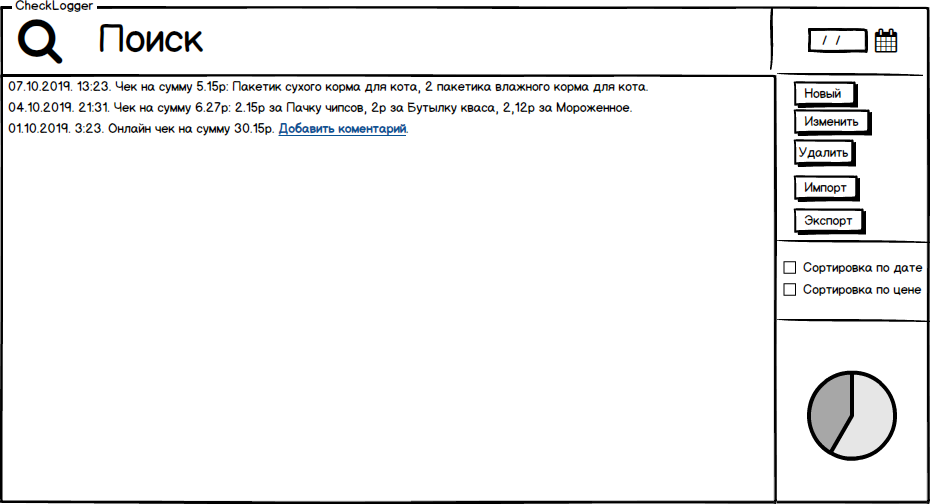
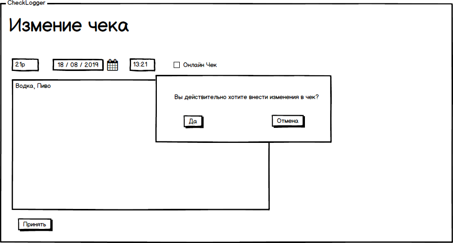
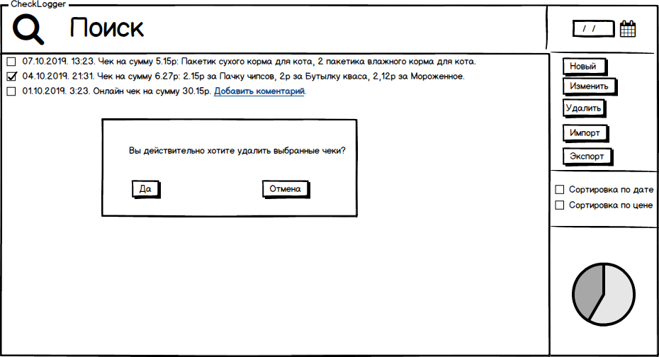
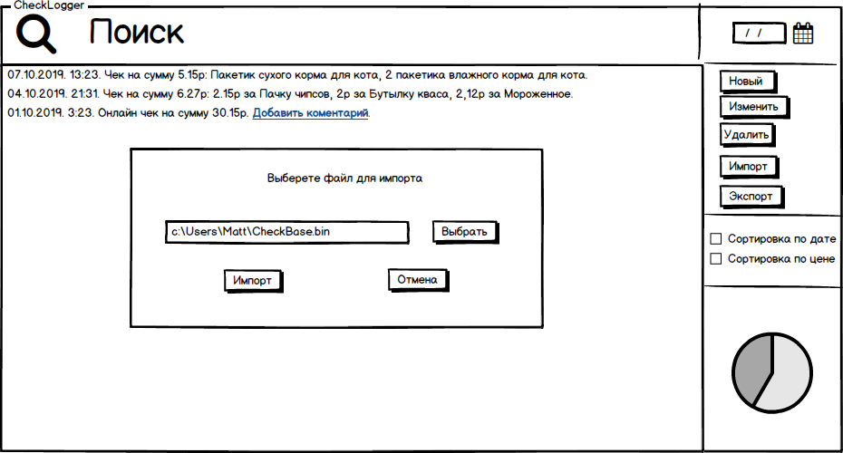

# Требования к проекту
---

# Содержание
1 [Введение](#start) 
1.1 [Назначение](#appointment) 
1.2 [Бизнес-требования](#bisuness_requirenments) 
1.2.1 [Исходные данные](#first_info) 
1.2.2 [Возможности бизнеса](#bisuness_opportunities) 
1.2.3 [Границы проекта](#project_line) 
2 [Требования пользователя](#user_requirenments) 
2.1 [Программные интерфейсы](#program_interfaces) 
2.2 [Интерфейсы пользователя](#user_interfaces) 
2.3 [Характеритстики пользователя](#user_characteristics) 
3 [Системные требования](#system_requirenments) 
3.1 [Функциональные требования](#functional_requirenments) 
3.1.1 [Основные функции](#main_functions) 
3.1.1.1 [Вход неактивного пользователя в приложение](#user_visit) 
3.1.1.2 [Настройка профиля активного пользователя](#user_sign_in) 
3.1.1.3 [Добавление нового ингредиента](#create_item) 
3.1.1.4 [Составление нового рецепта](#create_recipe) 
3.2 [Нефункциональные требования](#nonfunctional_requirenments) 
3.2.1 [Атрибуты качества](#quality) 
3.2.1.1 [Требования к удобству использования](#use_requirements) 
3.2.1.2 [Требования к безопасности](#security_requirements) 
3.2.2 [Внешние интерфейсы](#outside_interfaces) 

<a name ="start"><a/>

# 1 Введение

<a name ="appointment"><a/>

## 1.1 Назначение

В этом документе описаны функциональные и нефункциональные требования к Dekstop приложению «CheckLogger».

<a name ="bisuness_requirenments"><a/>

## 1.2 Бизнес-требования

<a name ="first_info"><a/>
          
### 1.2.1 Исходные данные

В двадцать первом веке стало удобно использовать в повседневной жизни банковские карточки для оплаты онлайн и локальных покупок. Однако, иногда становится сложно разобраться за что тогда в пятницу в 21:31 ты отдал свои 3$. Приложение созданно для облегчения процесса хранения информации о ваших покупках.

<a name ="bisuness_opportunities"><a/>
  
### 1.2.2 Возможности бизнеса

Синхронизация чеков, приходящих через смс на ваш смартфон с приложением. Ручное добавление чеков. Изменения описания чеков. 

<a name ="project_line"><a/>
  
### 1.2.3 Границы проекта

Данное приложения позволяет добавлять комментария вашим чеки для более глубокого анализа расходов из вашего бюджета. 

<a name ="user-requirenments"><a/>

# 2 Требования пользователя

<a name ="program_interfaces"><a/>
          
## 2.1 Программные интерфейсы

Приложение разрабатывается на платформе Java под операционные системы Windows.

<a name ="user_interfaces"><a/>
          
## 2.2 Интерфейсы пользователя

Окно для просмотра сохраненных чеков.

Окно для и добавления новых чеков.

Окно для редактирования чеков.

 

Всплывающее окно удаления чека.

 

Всплывающее окно экспорта чеков.

 

Всплывающее окно импорта чеков.

 

<a name ="user_characteristics"><a/>

## 2.3 Характеристики пользователя

Данное приложение расчитанно на людей, которые пользуются банковскими картами.

<a name ="system_requirenments"><a/>
          
# 3 Системные требования

<a name ="functional_requirenments"><a/>
          
## 3.1 Функциональные требования

<a name ="main_functions"><a/>
          
### 3.1.1 Основные функции

<a name ="user_visit"><a/>
          
#### 3.1.1.1 Вход нового пользователя в приложение

**Описание.** Для безопасности личной информации, вход в приложение выполнен в виде ввода личного пароля. В случае первого входа в приложение, предоставляется возможность создания нового пароля.

| Функция | Требования | 
|:---|:---|
| Вход в приложение впервые | Приложения предоставляет окно ввода нового пароля, а также подсказки для него. |
| Вход в приложение | Приложение требует ввода пользователем пароля. В случае трёх неудачных попыток, выводит подсказку на экран. |

<a name ="user_sign_in"><a/>
 
#### 3.1.1.2 Функционал базы даныных приложения.

**Описание.** Приложение предоставляет возможность синхронизировать имеющийся чеки, редактировать их, а также вносить в них новые данные.

| Функция | Требования | 
|:---|:---|
| Синхронизация через файл | Приложение требует ввода пользователем необходимого файоа с данными о прошлых чеках. |
| Редактирование чека | Изменение определенных параметров в уже добавленном чеке. |
| Добавление чека | Необходимо ввести параметры для чека. |
| Удаление чека | Удаление выбранного чека. |

<a name ="create_item"><a/>
          
#### 3.1.1.3 Синхронизация чеков
**Описание.** Пользователь имеет возможность импортировать прошлые чеки.

**Требование.** Приложение должно предоставить пользователю возможность выбрать файл, в котором хранится информация о прошлых чеках.
<a name ="create_recipe"><a/>
          
#### 3.1.1.4 Добавление нового рецепта
**Описание.** Пользователь имеет возможность добавить новый чек.

**Требование.** Приложение должно предоставить пользователю возможность создания нового чека. Требуется ввод суммы, времени покупки и коментария по чеку.    

<a name ="nonfunctional_requirenments"><a/>
          
## 3.2 Нефункциональные требования

<a name ="quality"><a/>
          
### 3.2.1 Атрибуты качетсва   

<a name ="use_requirements"><a/>
          
#### 3.2.1.1 Требования к удобству использования

* Все функциональные элементы пользовательского интерфейса имеют названия, описывающие действие, которое произойдет при выборе cсоотвествующего элемента;
* Удобное расположение элементов графического интерфейса способствует быстрому ориентированию в приложении;
* Пошаговая инструкция использования основных функций приложения отображена в справке.

<a name ="security_requirements"><a/>
          
#### 3.2.1.2 Требования к безопасности

Редактирование и добавление заметок чека осуществляется только при условии правильного входа в приложение.         

<a name ="outside_interfaces"><a/>
          
### 3.2.2 Внешние интерфейсы

Окна приложения удобны для использования пользователями с плохим зрением:
  * размер шрифта удобен для восприятия;
  * функциональные элементы контрастны фону окна;
  * отсутствие ярких изображений не отвлекает внимание во время приготовления.
